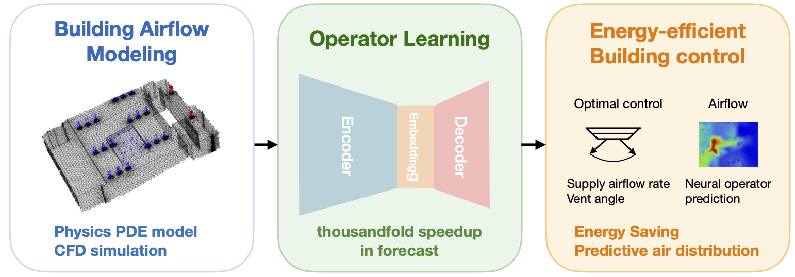
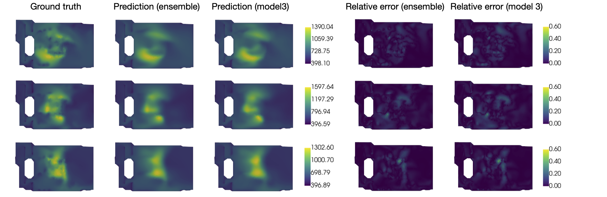

# BuildingControlCFD

This repository accompanies the paper:  
<<<<<<< HEAD
**_Data-driven operator learning for energy-efficient building control_**  Please cite our paper. 

The code integrates CFD-based airflow simulation, operator learning (neural operator models), and optimization-based control with neural operators to enable energy-efficient and ventilation control. 


<p align="center">
  
</p>
</p><p align="center"><em>Figure 1. Our Framework</em></p>


<p align="center">
  
</p><p align="center"><em>Figure 2. Predicted indoor airflow distribution from the learned operator model. Proposed Ensemble Neural Operator increases accuracy and facilitate downstream control</em></p>


## ⚙️ Installation

### Setup
```bash
git clone https://github.com/yourusername/BuildingControlCFD.git
cd BuildingControlCFD
```
Make sure you follow https://github.com/HaoZhongkai/GNOT to install dgl and related requirement package to train neural operator transformers. 

### Usage
### 1. Run CFD Simulation (Optional)
We already provide dataset from seed = 0 to 300   
However, if you want to generate transient airflow fields for a building geometry:
```bash
python simulation/transient_simulation.py --seed 0
```

### 2. Train Neural Operator
Train data-driven surrogate models on CFD data:
```bash
python learning/train.py 
```

### 3. Optimize Control Strategy and Visualize
Use optimization-based control (MPC) with learned operators:
```bash
control/control_optimization.ipynb
```
Inspect spatial-temporal air distribution and control performance:
```bash
control/visualize.ipynb
```
=======
**_Data-driven operator learning for energy-efficient building control_**  
> The code will be made publicly available soon.
>>>>>>> a480ef05ecf63d1cdcc0e34264012bea0faeb051

## 📂 Dataset Access

We release our computational fluid dynamics (CFD) dataset on [Hugging Face 🤗 Datasets](https://huggingface.co/datasets/alwaysbyx/Bear-CFD-dataset).  
The dataset is designed to support research in **scientific machine learning**, especially for learning **neural operators** and **data-driven PDE solvers**.

### 🔧 Dataset Details

- **Simulation Tool:** ANSYS FLUENT 2023R2  
- **Data Types:**  
  - Steady-state flow simulations  
  - Transient (time-dependent) flow simulations  
- **Domain:** Indoor air flow and CO₂ concentration in ventilated building environments  
- **Applications:**  
  - Neural operator learning  
  - Spatiotemporal modeling  
  - Model-based control for HVAC systems

## 📜 License & Citation

The dataset and code are released for **research purposes only**.

If you use this dataset in your published work, please cite the following paper:

> **Data-driven operator learning for energy-efficient building control**  
> *Yuexin Bian, Yuanyuan Shi*  
> [arXiv:2504.21243](https://arxiv.org/abs/2504.21243)

### 📚 BibTeX
```bibtex
@article{bian2025data,
  title={Data-driven operator learning for energy-efficient building control},
  author={Bian, Yuexin and Shi, Yuanyuan},
  journal={arXiv preprint arXiv:2504.21243},
  year={2025}
}
```

## 📫 Contact

For questions or collaborations, feel free to reach out via [Email](yubian@ucsd.edu). I am happy to answer any questions and collaborate! 

<<<<<<< HEAD
---
=======
---
>>>>>>> a480ef05ecf63d1cdcc0e34264012bea0faeb051
